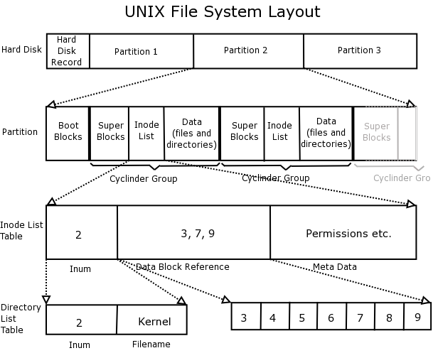

## 6. Intern Filesysteem
### 6.1 Disks en filesystemen
* Alles behoort tot root directory `/`
* Bestanden kunnen op verschillende medium staan (partities, usb, ...)
* Logical Volume Manager (LVM) beheert meerdere logische volumes (kan dus meerdere disks hebben). Deze kan de schijf dynamisch vergroten of verkleinen.

#### Mount en Unmount
Deze 2 commando's laten ons toe mediums toe te voegen aan het file systeem.

standaardvorm:

```bash
mount -t type device dir
```

dit is meestal enkel toegelaten voor de administrator, vb mounten floppy:

```bash
mount -t vfar /dev/fd0 floppy
```

-t accepteerd ook het keyword `auto` wat het filesysteem zelf gaat zoeken:

```bash
mount -t auto /dev/fd0 floppy
```

Als we `mount` uitvoeren zonder parameters zien we de huidige mounted filesystemen. Deze kunnen we ook terug vinden in de file `/etc/mtab`.

In `/proc` kunnen we het filesysteem zien dat zich in het intern geheugen schuilhoudt.

Unmount gaat ons toelaten een device te verwijderen: 

```bash
unmount /dev/fd0
# OF
unmount /mnt/floppy
```

#### /etc/fstab de coinfiguratiefile van het filesysteem
* Noemt fstab onder SynOS en Linux
* Noemt mnttab onder HP-UX
* Noemt vsftab onder solaris
* Noemt filesystems onder AIX
* Bevat 1 lijn per device met waar men deze mount + opties, vb:

```bash
# device-spec   mount-point     fs-type      options                                          dump pass
LABEL=/         /               ext4         defaults                                            1 1
/dev/sda6       none            swap         defaults                                            0 0
none            /dev/pts        devpts       gid=5,mode=620                                      0 0
none            /proc           proc         defaults                                            0 0
none            /dev/shm        tmpfs        defaults                                            0 0
 
# Removable media
/dev/cdrom      /mnt/cdrom      udf,iso9660  noauto,owner,ro                                     0 0
 
# NTFS Windows 7 partition
/dev/sda1       /mnt/Windows    ntfs-3g      quiet,defaults,locale=en_US.utf8,umask=0,noexec     0 0
 
# Partition shared by Windows and Linux
/dev/sda7       /mnt/shared     vfat         umask=000                                           0 0
 
# mounting tmpfs
tmpfs           /mnt/tmpfschk   tmpfs        size=100m                                           0 0
 
# mounting cifs
//pingu/ashare  /store/pingu    cifs         credentials=/root/smbpass.txt                       0 0
 
# mounting NFS
pingu:/store    /store          nfs          rw                                                  0 0
```

##### 1ste en 2de veld
Dit is de naam van het device file en de directorystructuur.

##### 3de veld
|Optie|Uitleg|
|-----|------|
|defaults|dit zijn rw, suid, dev, exec, auto, nouser en async|
|rw|read write|
|ro|read only|
|suid|laat SUID en SGID bits hun effecten toe|
|dev|interpreteert speciale device files|
|exec|laat uitvoering van binaire files toe|
|auto|kan gemount worden tijdens boot|
|nouser|verbiedt gewone gebruiker het filesysteem te monteren|
|async|alle I/O gebeurd async|
|user|laat gebruiker het device mounten, impliceert wel noexec, nosuid, nodev|
|noauto|kan niet gemount worden op boot.|

##### 4de veld
Om de hoeveel dagen wordt er een dump genomen.

##### 5de veld
Bepaalt volgorde waarmee `fsck` de filesystemen moet controleren, is 1 voor `/`. 0 betekent geen automatische controle.

##### Gebruik /etc/fstab
* `mount -a` gaat dit ook aanpassen
* Als filesysteem hierin staat kunnen we mounten met `mount /dev/fd0`
* Enkel root kan filesysteem mounten tenzijn expliciet vermeld

#### df  commando
disk free, kijkt naar gebruikte diskspace

```bash
 Filesystem    1024-blocks      Free %Used    Iused %Iused Mounted on
 /dev/hd4            32768     16016   52%     2271    14% /
 /dev/hd2          4587520   1889420   59%    37791     4% /usr
 /dev/hd9var         65536     12032   82%      518     4% /var
 /dev/hd3           819200    637832   23%     1829     1% /tmp
 /dev/hd1           524288    395848   25%      421     1% /home
 /proc                   -         -    -         -     -  /proc
 /dev/hd10opt        65536     26004   61%      654     4% /opt
```

### 6.2 Filesystem blocks


Filesysteem bestaat uit blokken van veelvoud van 512 (512, 1024, 2048, ...)

Bekijk volgende schijf indeling:

* MBR
* Partitie 1
* Partitie 2

We zien dat `Partitie 1` de volgende structuur heeft:

* boot-blok
* Beschrijfbaar deel

Het boot-blok bevat de opstartcode voor het systeem, dit kan ook in de MBR zitten. De rest kan gegevens bevatten.

Een schijf kunnen we dan formatteren met:

```bash
mkfs device
```

Kijken we nog verder zien we een super blok, inodes en blokken met data. Het superblok beschrijft de status van het filesysteem (omvang, naam filesysteem, naam volumes, ...) 

we kunnen het superblok bekijken met volgend commando:

```bash
tune2fs -l /dev/hda3
```

Bij het configureren legt men het aantal inodes vast in het superblok. Voor elke inode is er een fysisch fileobject aanwezig.

Na de inodes hebben we de datablokken, deze lopen tot het einde en bevatten de eigenlijke gegevens.

#### Variaties
|variatie|uitleg|
|--------|------|
|HP-UX|verdeelt grote blokgrootte in kleinere fragmenten|
|e2fs|extended filesystem 2, deelt schijf op in blokgroepen|