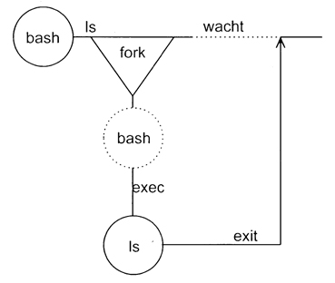
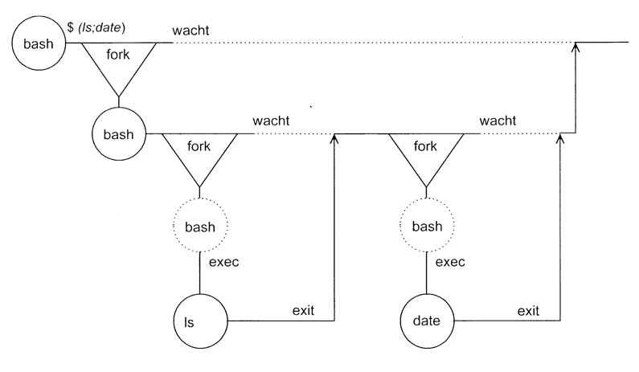

# 7. Processes
## 7.1. Soorten Processen
|Proces|Beschrijving|
|-|-|
|Interactieve processen|Deze kunnen in de voorgrond of achtergrond gestart worden. We kunnen ze ook beheren door volgende commando's: ▸ `&`: Voert commando uit op achtergrond ▸ `Ctrl-Z (^Z)`: Stopt voorgrond proces ▸ `jobs`: Geeft lijst van achtergrond processen ▸ `%n`: Geeft job op achtergrond met nummer n ▸ `%?str`: Refereert naar job die str bevat ▸ `bg`: Herstart gestopt proces op de achtergrond ▸ `fg`: Brengt een achtergrond proces naar de voorgrond ▸ `kill`: Stopt een proces met PID |
|Daemons|Deze starten op op de achtergrond en zijn idle zolang ze niet gebruikt zijn (meestal on boot).|
|Batch Processen|Dit is een groep van meerdere processen. Deze hebben vaak te veel CPU nodig en worden in een queue geplaatst die sequentieel wordt afgewerkt.|

## 7.2. Procesattributen
|Attribuut|Beschrijving|
|-|-|
|Process Id (PID)|Uniek nummer toegekend aan een proces|
|Parent process id (PPID)|PID van het parent proces (proces dat dit heeft opgestart)|
|Nice Number|Prioriteit van behandeling voor een proces.|
|TTY|Naam van device file van de terminal|
|Real and Effective User id (RUID,EUID)|**RUID:** nummer van de gebruiker die het proces gestart heeft. **EUID:** Gebruikersnummer om de toegang tot systeembronnen te vragen, als SUID bit gezet is dan is dit de waarde van de owner van deze file|
|Real and Effecitve Group id (RGID, EGID)|**RGID:** Huidige groep van de gebruiker die het proces start **EGID:** Als SGID gezet is dan is dit de owner.

## 7.3. Procesinformatie tonen
Dit wordt gedaan door het commando `ps`. Echter doordat dit verschilt van distributie tot distributie is het beter om de man pages door te gaan.

## 7.4. Creatie processen
Een proces wordt aangemaakt door een systeem call naar `fork()` te doen. Dit gaat als volgt:

1. Parent roept `fork()` aan.
2. Child wordt aangemaakt en toegevoegd aan procestabel met het return adres van de parent.
3. `fork()` dupliceert de parent in de child. (Child krijgt dus kopie van heap en stack)
4. Als return waarde krijgt de parent het nieuwe PID van de child, child krijgt 0 of negatief als error
5. Parent en child gaan verder met uitvoeren.
6. Als child geen background proces is gaat de parent wachten met `wait()`. Deze wacht nu tot de child exit heeft gedaan.
7. De child roept `exec()` aan zodat deze zijn geheugen overschrijft door de code van de child.
8. Child roept `exit()` op als deze klaar is.
9. Parent ziet dat child klaar is en gaat verder.

**Voorbeeld:** uitvoering van het commando `ls`

**Voorbeeld:** uitvoering van het commando `ls;date`

**Voorbeeld:** uitvoering van het gegroepeerde commando `(ls;date)`
