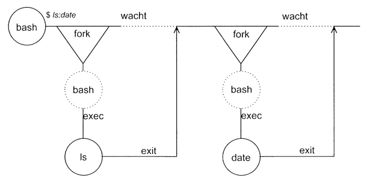

# 7. Processes
## 7.1. Soorten Processen
|Proces|Beschrijving|
|-|-|
|Interactieve processen|Deze kunnen in de voorgrond of achtergrond gestart worden. We kunnen ze ook beheren door volgende commando's:<br />▸ `&`: Voert commando uit op achtergrond<br />▸ `Ctrl-Z (^Z)`: Stopt voorgrond proces<br />▸ `jobs`: Geeft lijst van achtergrond processen<br />▸ `%n`: Geeft job op achtergrond met nummer n<br />▸ `%?str`: Refereert naar job die str bevat<br />▸ `bg`: Herstart gestopt proces op de achtergrond<br />▸ `fg`: Brengt een achtergrond proces naar de voorgrond<br />▸ `kill`: Stopt een proces met PID<br />|
|Daemons|Deze starten op op de achtergrond en zijn idle zolang ze niet gebruikt zijn (meestal on boot).|
|Batch Processen|Dit is een groep van meerdere processen. Deze hebben vaak te veel CPU nodig en worden in een queue geplaatst die sequentieel wordt afgewerkt.|

## 7.2. Procesattributen
|Attribuut|Beschrijving|
|-|-|
|Process Id (PID)|Uniek nummer toegekend aan een proces|
|Parent process id (PPID)|PID van het parent proces (proces dat dit heeft opgestart)|
|Nice Number|Prioriteit van behandeling voor een proces.|
|TTY|Naam van device file van de terminal|
|Real and Effective User id (RUID,EUID)|**RUID:** nummer van de gebruiker die het proces gestart heeft.<br />**EUID:** Gebruikersnummer om de toegang tot systeembronnen te vragen, als SUID bit gezet is dan is dit de waarde van de owner van deze file|
|Real and Effecitve Group id (RGID, EGID)|**RGID:** Huidige groep van de gebruiker die het proces start</br >**EGID:** Als SGID gezet is dan is dit de owner.

## 7.3. Procesinformatie tonen
Dit wordt gedaan door het commando `ps`. Echter doordat dit verschilt van distributie tot distributie is het beter om de man pages door te gaan.

## 7.4. Creatie processen
Een proces wordt aangemaakt door een systeem call naar `fork()` te doen. Dit gaat als volgt:

1. Parent roept `fork()` aan.
2. Child wordt aangemaakt en toegevoegd aan procestabel met het return adres van de parent.
3. `fork()` dupliceert de parent in de child. (Child krijgt dus kopie van heap en stack)
4. Als return waarde krijgt de parent het nieuwe PID van de child, child krijgt 0 of negatief als error
5. Parent en child gaan verder met uitvoeren.
6. Als child geen background proces is gaat de parent wachten met `wait()`. Deze wacht nu tot de child exit heeft gedaan.
7. De child roept `exec()` aan zodat deze zijn geheugen overschrijft door de code van de child.
8. Child roept `exit()` op als deze klaar is.
9. Parent ziet dat child klaar is en gaat verder.

**Voorbeeld:** uitvoering van het commando `ls`

Hier zien we dat bash een fork gaat maken om ls uit te voeren. ls gaat dan exec uitvoeren en uiteindelijk het werkelijke commando. Bash wacht nu tot ls exit oproept vooraleer verder te gaan.


**Voorbeeld:** uitvoering van het commando `ls;date`

Bij 2 commando's na elkaar is dit juist hetzelfde maar deze worden dan na elkaar uitgevoerd.



**Voorbeeld:** uitvoering van het gegroepeerde commando `(ls;date)`

Bij een gegroepeerd commando ligt dit net iets anders. Bash gaat een fork uitvoeren maar in deze fork worden beide commando's uitgevoerd. We krijgen dus een parent (bash) die een child aanmaakt. Deze child maakt dan een nieuwe child aan die het commando zelf gaat uitvoeren.


**Voorbeeld:** Piping who aan sort `who|sort`

Bij piping worden onmiddelijk 2 processen geforked. Het laatste command start men als eerste, zo voort tot alle processen zijn opgestart. Deze commando's gaan nu op hen input lijn lezen naar input.


De ultieme voorouder van alle processen is het proces met PID=1. Dit is het init proces en wordt opgestart bij de boot.

Om een job uiteindelijk op te starten in de achtergrond en ervoor te zorgen dat deze niet afsluit nadat men de TTY afsluit kan men gebruik maken van het `nohup` commando.

```bash
nohup job  &
```

## 7.5. Signalen en het verwijderen van processen
Een signaal kunnen we verwijderen met het `kill` commando. Echter is dit algemener en dient het om signalen naar processen te sturen.

Bij het verzenden van een signaal kan een proces op 3 manieren reageren:
* Het proces heeft een functie die het signaal opvangt en dan een actie uitvoert.
* De standaardactie wordt uitgevoerd.
* Het signaal kan worden genegeerd. Echter het signaal SIGKILL en SIGSTOP kunnen niet worden genegeerd.

**Overzicht signalen:**

|Signaal|Nr|Standaard actie|Betekenis|
|-|-|-|-|
|SIGHUP|1|einde|Hangup: verbinding terminal verbroken|
|SIGINT|2|einde|Interrupt: break is ingevoerd in de terminal (CTRL-C)|
|SIGQUIT|3|einde + geheugendump|quit: DEL toests of CTRL-\ met de bedoeling voor geheugeninhoud te verkrijgen.|
|SIGKILL|9|einde|Kill process, kan niet worden opgevangen of geblokkeerd|
|SIGTERM|15|Terminate: Beindig proces zo snel mogelijk, het kan nog wel dingen afwerken (sluiten bestanden, ...)|
|SIGSTP|24|stop|Betekent het indrukken van de job-cotnrole toets stop (CTRL-Z)|


## 7.6. Opvangen van signalen in de shell